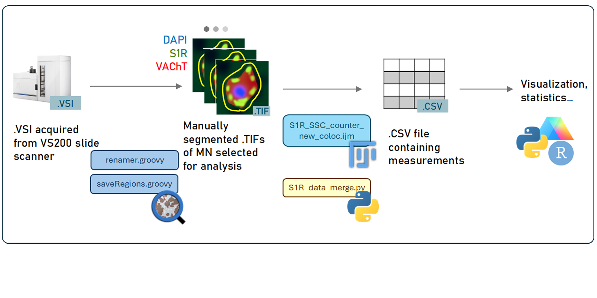

# S1R Project

Last edited: 2026-06-22

## Introduction

This document provides addtional information regarding the intended purpose and usage guidelines for the image analysis workflow developed for the S1R project of Ravits lab. <br>
At the time of this document being written, the S1R project primarily focuses on: 
1. Establish the presence of S1R-positive subsurface cisterns (S1R-SSCs) as a post-synaptic feature of cholinergic c-boutons in alpha and beta motor neurons, but <u>not</u> in gamma motor neurons. 
2. Examine how ALS affects S1R-SSCs.

To achieve that, we need to segment the motor neurons and the S1R-SSCs they contain from IF images of spinal cord, and acquire relevant measurements for downstream analysis. 
## Workflow
The pipeline described below includes 4 files:
1. `S1R_SSC_counter_new_coloc.ijm` <br>
2. `S1R_data_merge.py`
3. `renamer.groovy`*
4. `saveRegions.groovy`*

    \* These file live in the "Groovy" folder under the root directory. This is because they are general-use, non-S1R-project-specific scripts.
<br>
<br>   
> Unfortunately, this workflow was not setup with portability in mind. It was designed for a very specific purpose and will only work when given the right inputs. I will try my best to explain.
### Overview:

### Software requirements:
The workflow was configured in the following environment:
- QuPath 0.6.0
- FIJI 1.54p 
    - `MorphoLibJ` plugin is required, but it should be included in standard FIJI install.
- Python 3.14.1
    - `pandas`, `tkinter`, `re` libraries are required. They should be installed in a conda environment, which I used.
### Step-by-step:
1. `.vsi` files are acquired from an Olympus VS200 slide scanner fluorescent microsope. Each .vsi file should contain images from a single case.
2. Make sure the image files are named with the following pattern:<br>
    ```[case number]_[Ctrl or ALS]_[Tissue region]_[stain info].vsi```<br>
    Example filename:<br> 
    >`../`<br>
    |— `16_Ctrl_Med_647S1Rrb-594VChATrb.vsi` <br>
    |—`_16_Ctrl_Med_647S1Rrb-594VChATrb_`
    - I recommend this step to be done during the acquisition by setting slide names in the VS200 software. But it can also be done post-acquisitionally (is this a real word) (with a bit more hassle.) Consider using a regex-based renaming tool for batch renaming.
    - The script is only guaranteed to run properly ONLY IF this exact file name format is followed.
    - For each info cluster, you can use space and en-dash (-), but do not use underscore (_) or period (.). 
3. In `QuPath`, oragnize all images from which the cells will selected into a project.
4. Run `renamer.groovy` to remove the extra pyramid information that QuPath adds to each image's name.
    - Not cleaning up the image names here will risk breaking the script. 
5. Go through each image, and annotate the cells that you wish to include in analyses. Make sure you save your annotations frequently! The annotated outlines do not have to be 100% following the cell contour, but you should try to avoid including other cells inside the annotation. All cells that are considered positive for S1R-SSCs should be given the class `VChat-S1R`. S1R-related subcellular analysis will skip all cells that do not bear this class. Cells that have a class that is neither the flag class or `null` (class-less) will be skipped in all analyses.
    - This step is likely to be the bottleneck. Manual cell pre-segmentation is needed becuase the stain does not contain a good MN cytoplasm marker, making it wildly difficult to algorhythmically distinguish MNs from all the other features in a spinal cord/medulla. By doing the pre-segmentation, we only need to distinguish MNs from neuropil background, which is a much easier task.
    - If you want to change the class that will trigger the S1R-related subcellular analyses, you should update line 53 in `S1R_SSC_counter_new_coloc.ijm` accordingly. Only do this if you know what you are doing.
6. Once you have finished all your annotations for the entire project, run `saveAnnotations.groovy` FOR THE WHOLE PROJECT. This will export each annotated cell as a `.tif` file in a subfolder called `Exported` under the folder where the .qproject lives in.
    - If you choose to export the annotations in a different way, please confirm that 1) they have the correct file name patterns, and 2) when opened in FIJI, the overlay object which should be the hand-drawn cell annotation is actively selected by default.
> Confirm that all the annotated cells are exported into the folder, then proceed.
7. In FIJI, run `S1R_SSC_counter_new_coloc.ijm`. Set input and output directory. The input directory should be the `Exported` folder (or whichever folder you moved the `.tif`s to), the output directory is your choice. The script will take a while to run depends on the amount of input. You can check the logs for progress.
> Confirm that there are output images of each cell's segmentation results, `results.csv` and `coloc.csv` in the output folder, then proceed.
8. In a python environment, run `S1R_data_merge.py`. You will have to select 1) `Results.csv` and 2) `Coloc.csv`, then 3) a folder where the merged data file will be saved in. 
> The path to Results/Coloc/Output can also be found in the log. 

## Output

### Checking segmentation results

The segemnted version of each cell should be saved in the output folder as `[case number]_[tissue region]_[cell ID]_mean.tif`. Here "mean" refers to the FIJI threshold algorhythm being used to segment the cytoplasm. Cells that were not flagged for S1R-SSC (i.e. do not have class "VChat-S1R") will have a **white** outline, while those flagged will have a **cyan** outline, with S1R puncta in **green** and VAChT puncta in **red**. The segmentation has been extensively tested to ensure it will work properly for most cells, but it is likely that it will miss a few. Please use these images to check the quality of segmentation, and exclude cells that are poorly segmented from downstream analysis.  

### Interpreting the measurement results

The output excel file contains 5 sheets, arranged hierarchically:
1. <b>Case level summary:</b> Summary of the cases/regions used and how many cells are used in each case/region.
2. <b>Cell level summary:</b> Contains measurements of each cell in each case/region and the number of puncta and coloc pairs for each cell.
3. <b>S1R puncta:</b> Measurements of each individual S1R punctum.
    - Area is in μm², un-normalized mean is in A.U., Center of Mass (CoM) is in pixel coord.
4. <b>VAChT puncta:</b> Measurements of each individual VAChT punctum.
5. <b>Coloc count:</b> Measurements of each coloc pair found in each cell.
    - CoM distance is in μm, Union and Intersect are in μm².

Each cell is uniquely identifiable by (`Case ID`+`Region`+`Cell ID`); 
Each punctum is uniquely identifiable (`Case ID`+`Region`+`Cell ID`+`SSC ID`).
